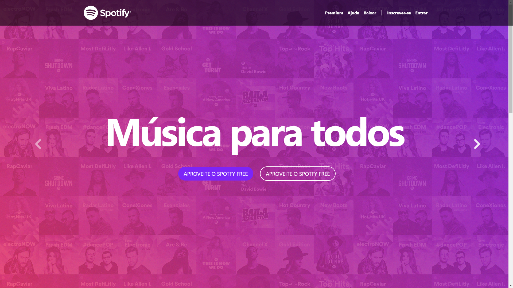
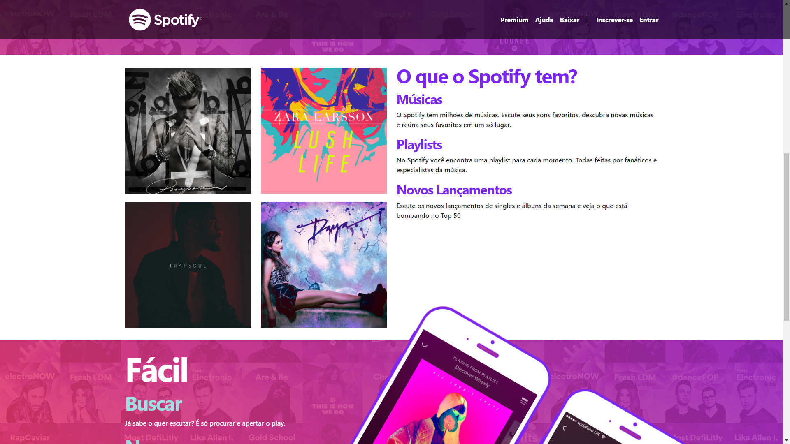
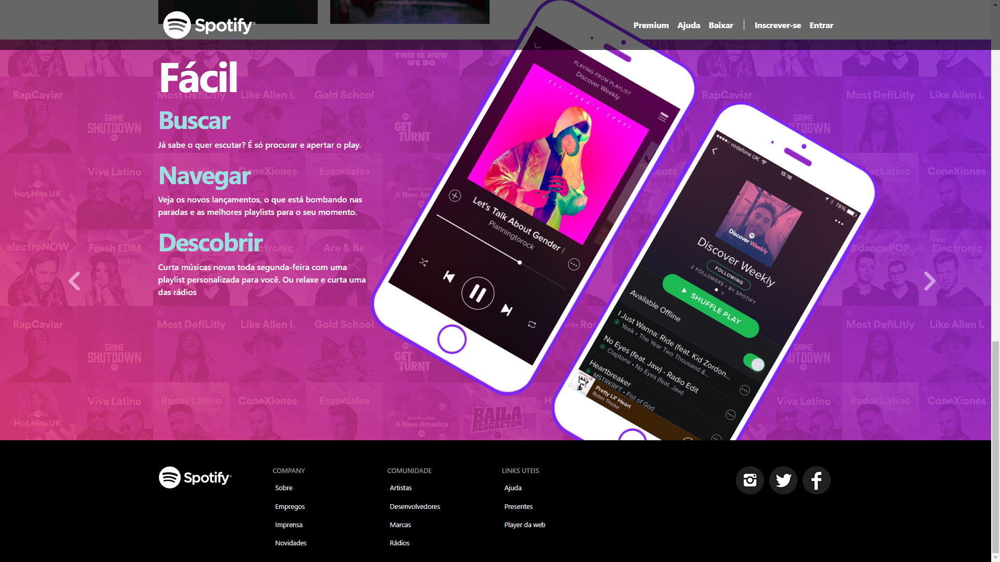

# Spotify Home Clone usando HTML | CSS | BootStrap5 

  

## Um clone de uma antiga página home do Spotify
### Projeto desenvolvido para fixação de conteúdos aprendidos em aula.
### A escolha de usar o BootStrap nesse projeto foi feita pela questão do site do Spotify usar esse framework para padronizar os seus componentes e atributos.

    

    

    

